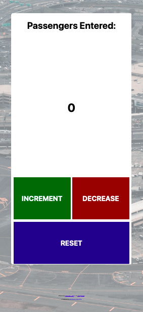

# About
A responsive passenger counter app inspired by the ["Learn JavaScript" course on Scrimba.com](https://scrimba.com/learn/learnjavascript).

## Contents

- [Overview](#overview)
- [Screenshot](#screenshot)
  - [Desktop](#desktop)
  - [Mobile](#mobile)
- [Status](#status)

## Overview

Inspired by the ["Learn JavaScript" course on Scrimba.com](https://scrimba.com/learn/learnjavascript), I added some extra features to the 'Build a passenger counter app' from the coursework.

I restyled this app to be used in the airline industry since my partner is a flight attendant and he (and his colleagues) actually has to do the task of counting passengers as they board the plane Previously, he's used a [mechanical counter](https://en.wikipedia.org/wiki/Mechanical_counter) for this, but seeing as this is the 21st Century and the age of apps I decided to create one myself.

I also added additional buttons for 'decrease' and 'reset'. The decrease button will 'decrease' the total passenger count by 1 (in case of error) and the 'reset' button will reset the counter back to the zero.

## Screenshot

### Desktop

### Mobile

## Status

A live version of the app can be viewed at https://ananfito.github.io/passenger-counter-app/.
