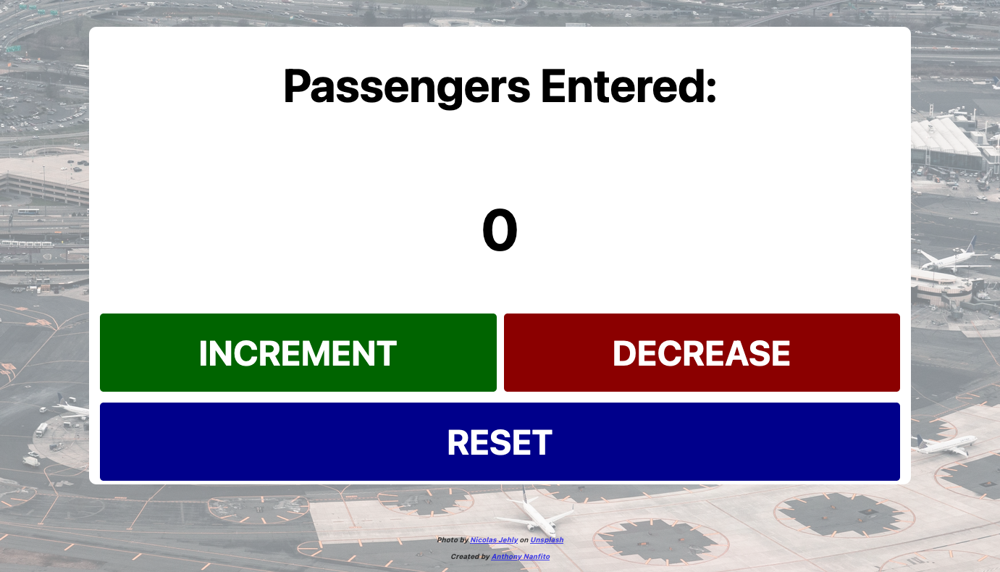

# About
Inspired by the ["Learn JavaScript" course on Scrimba.com](https://scrimba.com/learn/learnjavascript), I added some extra features to the 'Build a passenger counter app' from the coursework. I restyled this app to be used in the airline industry since my partner is a flight attendant and actually has to do the counting. Previously, he's used a [mechanical counter](https://en.wikipedia.org/wiki/Mechanical_counter) for this, but seeing as this is the 21st Century and the age of apps I decided to create one myself.

## Screenshot

## Live Version

A live version of the app can be viewed at https://ananfito.github.io/passenger-counter-app/.

## Status

The project is live and mostly complete. I still need to create a mobile-friendly for the app.
